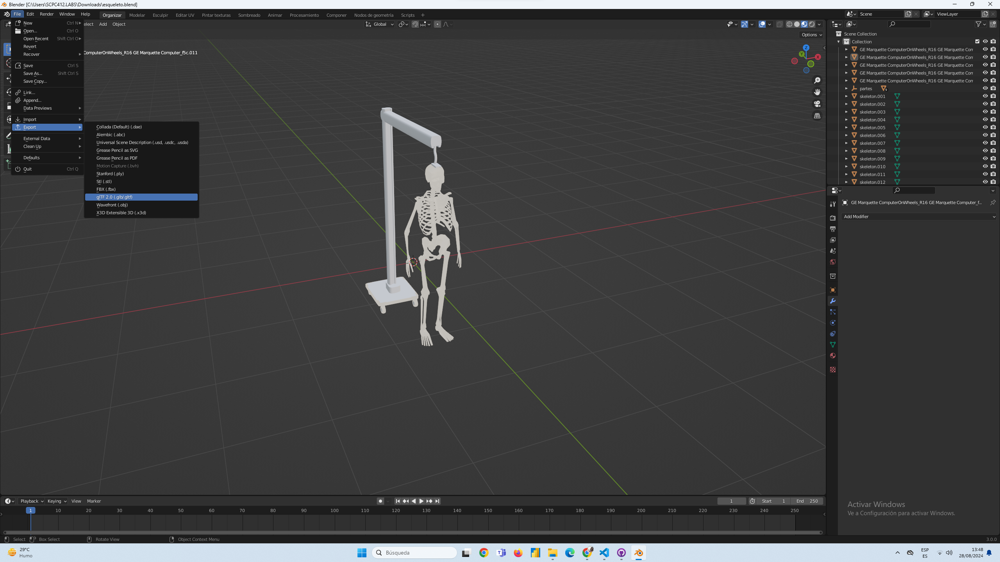
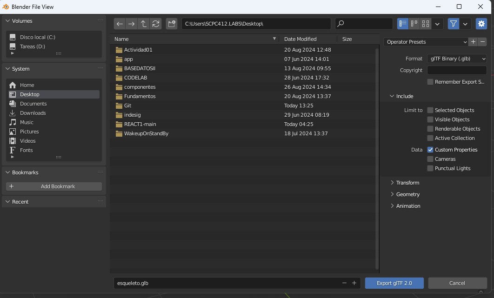
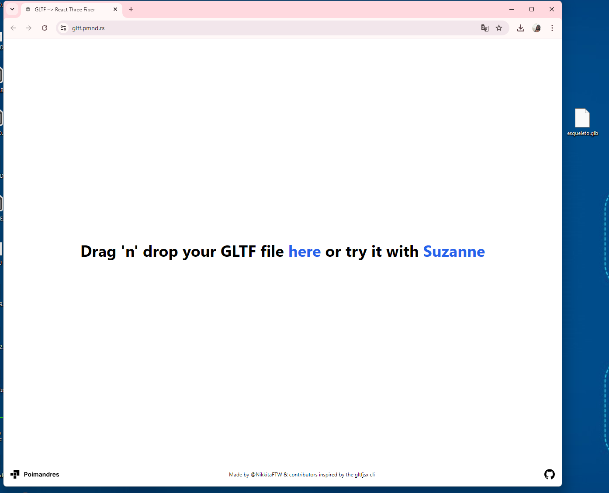
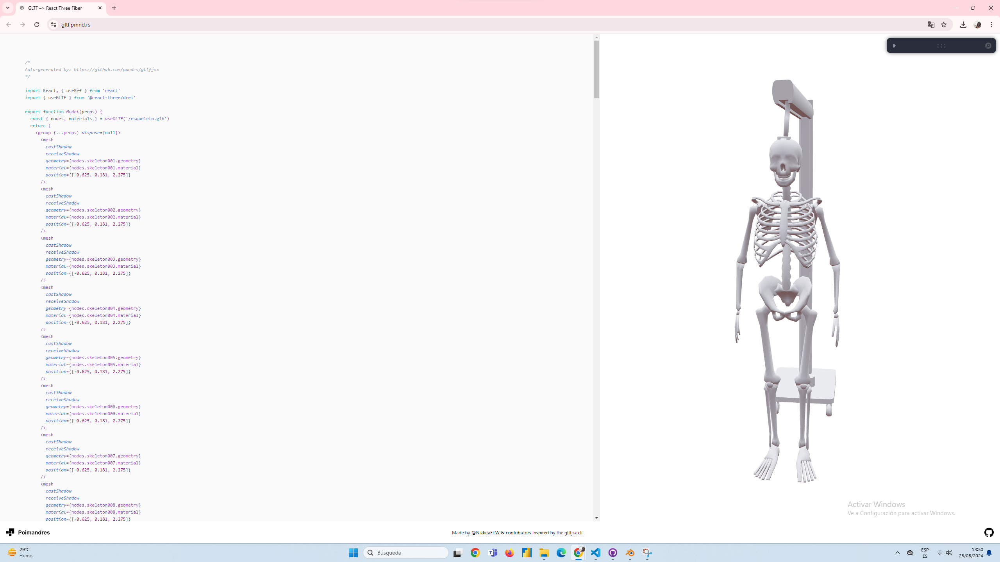
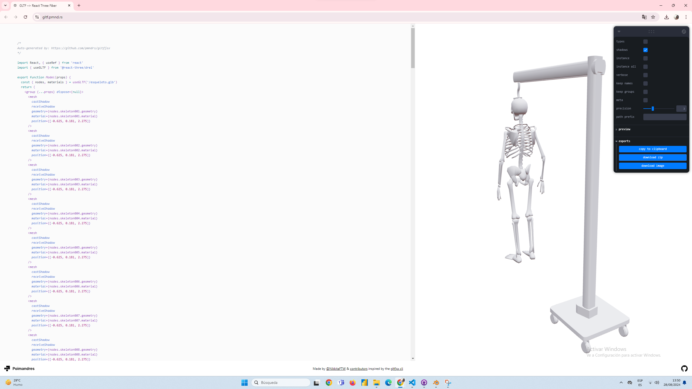
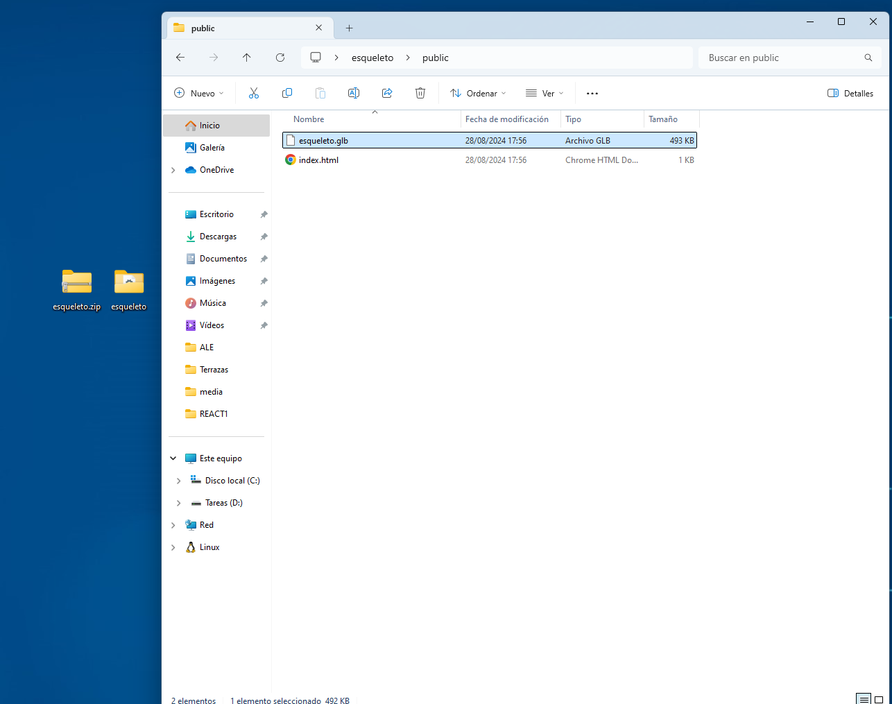
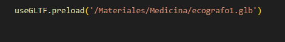
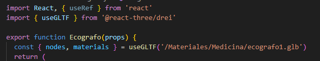
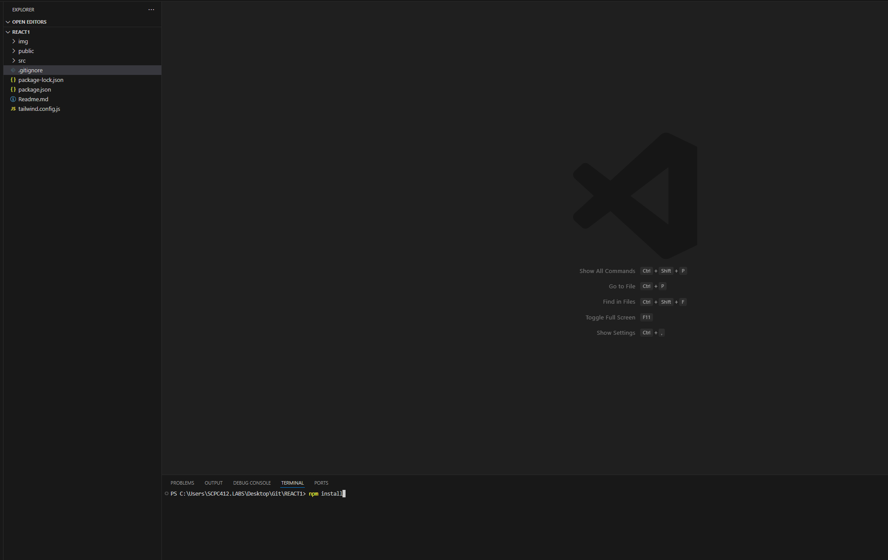
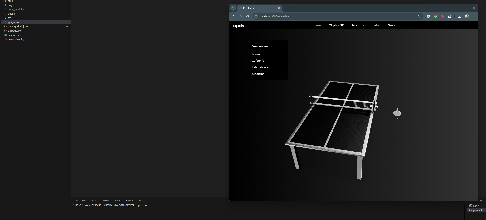

# Universidad Domingo Savio 3D Viewer

Este proyecto es una aplicación web desarrollada en React que proporciona una vista 3D interactiva de los objetos y las instalaciones de la Universidad Domingo Savio. Utilizando las librerías `@react-three/fiber` y `@react-three/drei`, se ofrece una experiencia inmersiva que permite a los usuarios explorar el campus y sus elementos en un entorno tridimensional.

Demo del sitio : https://reactmain-livid.vercel.app/

## Licencia

Proyecto realizado por estudiantes de la Universidad Domingo Savio.

- **Materia**: Sistemas Multimedia
- **Docente**: Ing. Jaime Zambrana
- **Alumnos**: Jaime Junior Aguilar Leaños, Jose Gonzales, Mario Terrazas
- **Carrera**: Ingeniería en Sistemas

Puedes seguir al autor en Instagram: [@asphyxiajr](https://www.instagram.com/asphyxiajr/).

## Características

- **Visualización 3D**: Explora diferentes objetos y áreas del campus de la Universidad Domingo Savio en un entorno 3D.
- **Navegación intuitiva**: Un navbar minimalista permite acceder fácilmente a diferentes escenas, incluyendo opciones como 'Escenas', 'Nosotros', 'Fotos', y 'Grupos'.
- **Selección de modelos**: Cambia entre diferentes modelos 3D (Aire, Monitor, Panel) dentro de la misma escena.
- **Captura de pantalla**: Captura la vista actual de la escena 3D desde cualquier ángulo utilizando el botón de descarga en el menú desplegable.

## Tecnologías Utilizadas

- **React**: Biblioteca de JavaScript para construir interfaces de usuario.
- **@react-three/fiber**: Rendereo 3D en React basado en Three.js.
- **@react-three/drei**: Utilidades adicionales para trabajar con Three.js en React.
- **GLTF**: Formato de archivo utilizado para cargar y renderizar los modelos 3D.

## Librerías Utilizadas en el Proyecto

Este proyecto utiliza varias librerías de JavaScript y CSS para proporcionar una experiencia de usuario interactiva y visualmente atractiva. A continuación, se detallan las principales librerías utilizadas:

### 1. [React](https://reactjs.org/)

**React** es una biblioteca de JavaScript para construir interfaces de usuario. En este proyecto, React se utiliza como la base para construir la estructura de la aplicación web, manejando los componentes de interfaz de usuario de forma eficiente y permitiendo una experiencia de usuario fluida.

**Instalación:**
npm install react react-dom

### 2. [@react-three/fiber](https://www.npmjs.com/package/@react-three/fiber)

**@react-three/fiber** es un renderer de React basado en [Three.js](https://threejs.org/), que permite integrar gráficos 3D en aplicaciones React. Esta librería se utiliza en el proyecto para renderizar modelos 3D y crear una vista interactiva del campus de la Universidad Domingo Savio.

#### Instalación:

npm install @react-three/fiber

### 3. [@react-three/drei](https://www.npmjs.com/package/@react-three/drei)

**@react-three/drei** es una colección de utilidades y componentes adicionales que facilitan el trabajo con Three.js en React. Proporciona componentes listos para usar que reducen el código necesario para agregar efectos y elementos comunes en escenas 3D. En este proyecto, se utiliza @react-three/drei para simplificar la configuración y manejo de las escenas 3D, permitiendo una integración más rápida y eficiente de modelos y efectos visuales.

#### Instalación:

npm install @react-three/drei

### 4. [GLTF](https://gltf.pmnd.rs/)

**GLTF** (GL Transmission Format) es un formato estándar para la transmisión y carga de escenas y modelos 3D en aplicaciones. Este formato es compacto y eficiente, lo que lo convierte en una excelente opción para la transmisión de gráficos 3D en aplicaciones web. En este proyecto, se utiliza GLTF para exportar modelos 3D desde Blender y cargarlos en la aplicación web para su visualización interactiva.

El uso de GLTF permite una integración fluida de modelos 3D complejos sin sacrificar el rendimiento de la aplicación. Además, facilita la interoperabilidad con otras herramientas de gráficos 3D, lo que simplifica el flujo de trabajo de los desarrolladores y diseñadores.

Para más detalles sobre el formato GLTF, puedes visitar su [documentación oficial](https://github.com/KhronosGroup/glTF).

### 5. [Tailwind CSS](https://tailwindcss.com/)

**Tailwind CSS** es un framework CSS de utilidad para construir rápidamente interfaces de usuario personalizadas sin necesidad de escribir CSS tradicional. A diferencia de otros frameworks, Tailwind CSS proporciona clases de utilidad de bajo nivel que se pueden combinar de diferentes maneras para crear un diseño único y responsivo. En este proyecto, Tailwind CSS se utiliza para estilizar la interfaz de usuario, proporcionando un diseño moderno y cohesivo con una personalización mínima.

Tailwind CSS permite a los desarrolladores construir componentes rápidamente utilizando clases como `flex`, `pt-4`, `text-center`, y muchas más. Esto resulta en un código más limpio y fácil de mantener, sin la necesidad de crear hojas de estilo personalizadas para cada componente.

#### Instalación:

Para instalar Tailwind CSS, sigue estos pasos:

1. Instala Tailwind CSS a través de npm:

   
   npm install tailwindcss

## Requisitos

Antes de comenzar, asegúrate de tener instalados los siguientes requisitos:

- **Node.js**: Entorno de ejecución para JavaScript, necesario para correr el proyecto. Es compatible con versiones 20 o superiores. Puedes descargarlo e instalarlo desde [nodejs.org](https://nodejs.org/).

- **Visual Studio Code**: Un editor de código fuente ligero pero potente que es ideal para trabajar con proyectos en JavaScript y React. Puedes descargarlo desde [code.visualstudio.com](https://code.visualstudio.com/). Asegúrate de instalar las extensiones necesarias para trabajar con React y JavaScript, como *ESLint* y *Prettier* para mejorar la calidad del código.

## Exportar Archivos de Blender a GTBL

Sigue los pasos a continuación para exportar archivos de Blender y convertirlos a GTBL:

1. **Abrir el objeto en Blender**: Abre el archivo de objeto 3D en Blender.

   
   

2. **Exportar el objeto a formato GLTF/GLB**: En Blender, selecciona `Archivo > Exportar > glTF 2.0 (.glb/.gltf)`. Asegúrate de seleccionar las configuraciones necesarias para la exportación.

   

3. **Convertir GLTF/GLB a código React usando la página web [gltf.pmnd.rs](https://gltf.pmnd.rs/)**:
   - Arrastra el archivo exportado (GLTF/GLB) sobre la página.
   - Verás una vista previa y podrás copiar el código generado.

   
   

4. **Crear la función en React**: Usa el código generado para crear una función que renderice el modelo en tu aplicación React.

5. **Renderizar el archivo GTBL**:
   - Puedes usar Blender para visualizar el archivo o la misma herramienta en la página web.
   - Al subir el archivo en la sección de "Export", selecciona "Download ZIP" para descargar los archivos.

   

6. **Obtener el archivo renderizado**:
   - Una vez descargado, en la sección "public" del ZIP encontrarás el archivo renderizado listo para usarse.

   

7. **Manejo de archivos GTBL en nuestro Proyecto**:
- Para poder Usar el codigo generado Debemos tomar en cuenta el Archivo GTBL exportado podes usar el de la pagina o e mismo que se exporta en blender. 
- Recomendacion Crear una carpeta En public para llamar alos archivos.

## Instalación

1. Clona este repositorio en tu máquina local:
   
   git clone https://github.com/Zcjota/REACT1.git

2. npm install

 

3. npm start
 

 

